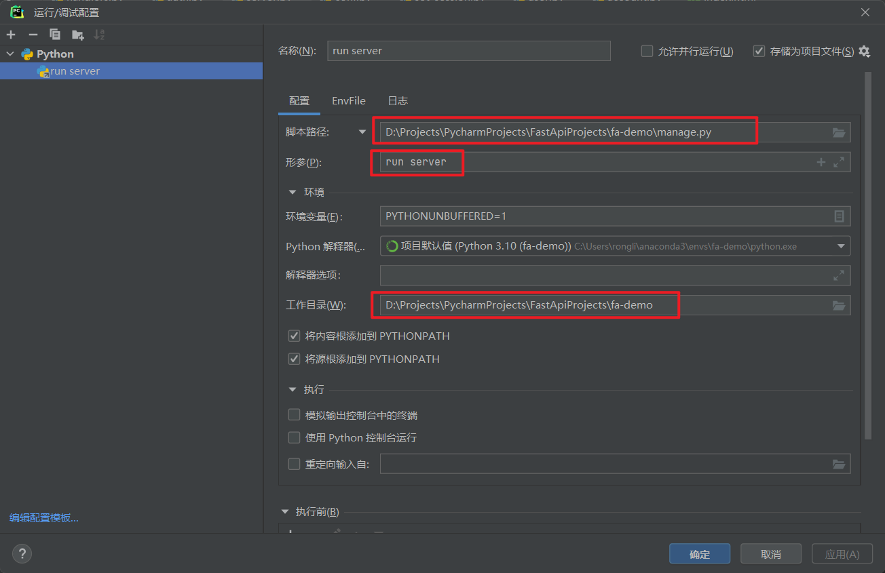

# 一、简介

> FastAPI 的小demo

## 仓库地址

感谢 **冰可乐** 大佬 [传送门](https://gitee.com/binkuolo/fastapi.git)

[后端代码仓库](https://gitee.com/nhnhwsnh/fastapi_demo)

[前端代码仓库](https://gitee.com/nhnhwsnh/vben_admin_demo)

[FastAPI 快速上手指南 - Bilibili视频](https://www.bilibili.com/video/BV1je4y1o7yX?vd_source=9f8f3da95270c6c4d6bafbe8da14beee)

## 演示站点

[本项目演示站点](http://fastapi.rongli.vip)【账号 admin / 密码 a12345678 】

[冰可乐大佬的演示站点](http://110.42.206.160/)【账号: admin 密码:123456】 **本站点由小Q提供并管理**

## 技术交流群

> 本群啥都可以聊Python，fastapi，js，vue，运维，数据库，人生，未来，感情.....，严禁开车，严禁广告，一次警告，两次拜拜！


**如果二维码过期，可以通过各种途径通知我**
**如果二维码过期，也可以去 issue 里面找找 [传送门](https://gitee.com/nhnhwsnh/fastapi_demo/issues)**

# 二、快速上手

## 1.下载代码

```shell
git clone https://gitee.com/nhnhwsnh/fastapi_demo.git
```

## 2。创建python虚拟环境

> 本项目使用的是 python3.10，推荐也用这个版本
>
> 其他版本，可能需要您自行处理一些版本间的差异问题（见本文第六部分）
>
> 过程略

## 3. 安装依赖

```shell
cd fastapi_demo
pip install -r requirements.txt
```

## 4. 启动 mysql 等基础设施

> 如果不习惯使用 docker 也可以自己手动搞定这些
>
> 版本要求：mysql 8.0.27 redis 6.2.7
>
> 其他版本，没测试过，不保证能跑起来。

```shell
docker-compose -f docker-compose.local.yml up -d
```

## 5. 迁移数据库

> 见下面的 aerich 使用方法
>
> deploy/mysql 目录下有一些初始的数据，可能对你有帮助

## 6. 运行项目

```shell
python manage.py run server
```

# 三、manage管理命令

## 查看 manage 命令帮助

```shell
python manage.py --help
```

## run server



启动服务，默认 localhost:8000

```shell
python manage.py run server 
```

如需修改主机或端口

```shell
python manage.py run server --host 127.0.0.1 --port 8888
```

## user createroot

此命令**不会**对用户名密码的格式进行检验

```shell
python manage.py user createroot --help
```

## start app

> 快速生成 app，不用重复的写CRUD

当前处于测试阶段
具体用法 -》 [传送门](./docs/startapp.md)

## start filter

+ 生成查询过滤的模型。
+ 生成内容请看： [backend/schemas/filter_for_dev.py](./backend/schemas/filter_for_dev.py)
+ 使用方法请看： [backend/routers/dev.py](./backend/routers/dev.py)
+ 演示接口：GET /api/v1/test/start/filter

# 四、aerich 使用方法

文档： [传送门](https://github.com/tortoise/aerich)

省流：[传送门](./docs/aerich.md)

# 五、继续开发

## 如果你修改了 `backend` 这个目录名，以下几处也要相应的修改

+ `manage.py`  ->  `from backend.commands import app`
+ `backend/commands/run.py`  -> `app='backend.main:app',`
+ 。。。

## 新建模型

+ 在 `backend/models` 目录下新增相应的文件，并将其加入到  `__init__.py` 中
+ 使用 aerich 迁移数据库

# 六、FAQ

## 问：simpel_captcha 安装失败，是怎么回事？怎么办？

> [simpel_captcha](https://pypi.org/project/simpel-captcha/) 要求 `Python >=3.9, <4.0`
>
> 如果你实在无法满足 `python >= 3.9`, 可以考虑换用 [fast-captcha](https://pypi.org/project/fast-captcha/)
>
> `fast-captcha` 对 `python`的要求低一点（`Python >=3.7, <4.0`）
>
> 这两个包的功能类似，使用方法也基本差不多！

## 问：`-> str | None` 报错，怎么办？

> python3.10 可以使用 `|` 来表示联合类型。
>
>例如 `phone: str | int` 表示 `phone` 可以是`str`类型，也可以是`int`类型
>
> `phone: str | int` 等价于 `phone: Union[str, int]`
>
> 如果你实在不想解决这个问题，把`-> str | None`删除了也可以！

## 问：我在本地运行了这个项目，为什么控制台会输出这么多东西？

> 为了方便开发阶段的调试，我把所有日志器的等级都设置到了 `DEBUG`
>
> 相应的设置文件在 `backend/config/logging.dev.json`
>
> 可以根据需要，自行修改配置

## 问：`backend/routers/dev.py` 里面写了好多测试的接口，项目上线会不会造成安全问题？

> 不会。
>
> `backend/routers/__init__.py` 中第 21-22 行，dev.py中的接口，只有在`settings.enable_test_router==True` 时才有效
>
> 项目上线时，只要在相应的 env 文件中加入 `ENABLE_TEST_ROUTER=false`，这些接口就不会生效了
>
> 这个文件里面写的接口，只是一些小例子，直接删除文件+相应的代码可以彻底解决这个问题！

## 问：`backend/config/conf.py`中的`Settings`类是如何读取环境变量的，我没看到`loadenv`啊？

> 请阅读`pydantic`的文档中关于`Settings management`的内容
> -> [传送门](https://pydantic-docs.helpmanual.io/usage/settings/)

## 问：为什么我在代码仓库中看到了`.env.dev` `.env.prod` ？

> 只是为了配合 `drone`, 快速地部署及更新演示站点。
>
> 正式的项目中，绝对不可能上传这些文件的。

## 问：`env_file = ".env.prod" if os.getenv('PROJECT_ENV') == 'prod' else ".env.dev"` 这行代码好奇怪啊？

> 见上一个问题。

## 问：`tortoise orm` 中如何使用原生sql？

> `backend/routers/dev.py` 中有示例。

## 问：`get_menulist` 命令，好奇怪，看不懂？有没有关于这个命令的解释？

> 这只是我自己想偷懒的时候，写的几行工具性质的临时代码，看不懂就删除了吧！

## ~~问：`encrypt_password`,为什么在utils里面，不应该在`user`里面吗？~~

> ~~这只是选择问题，您也可以把它作为一个类方法放到`User`模型中。~~
> ~~`verify_password` 同理。~~

## 问：`PageResp[AccountInfo](data=page_data)`, PageResp 为什么可以引用 AccountInfo ？

> 请自行百度`python 泛型`

## 问：我可以提个 pr 吗？

> 首先很感谢您对我的支持！

> 但是，此仓库是个镜像仓库，不接受pr，有事情可以提issue 或者 群内交流！