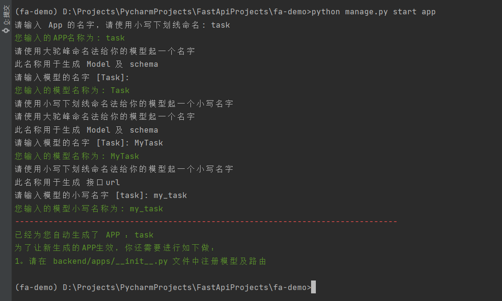
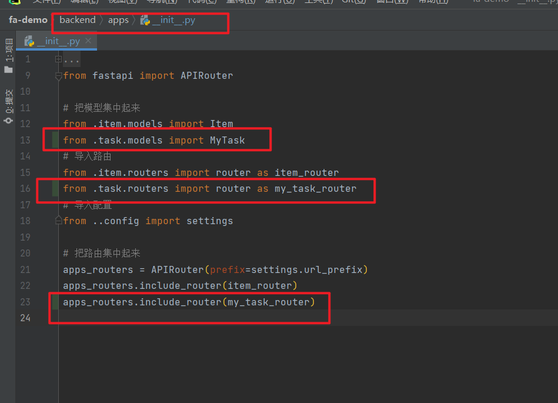

# start app

这个命令主要是为了少写一点CRUD代码。

## 使用方法

### 1. 运行命令

```shell
python manage.py start app 
# 请输入 App 的名字，请使用小写下划线命名: task
# 您输入的APP名称为: task
# 请使用大驼峰命名法给你的模型起一个名字
# 此名称用于生成 Model 及 schema
# 请输入模型的名字 [Task]:
# 您输入的模型名称为: Task
# 请使用小写下划线命名法给你的模型起一个小写名字
# 请使用大驼峰命名法给你的模型起一个名字
# 此名称用于生成 Model 及 schema
# 请输入模型的名字 [Task]: MyTask
# 您输入的模型名称为: MyTask
# 请使用小写下划线命名法给你的模型起一个小写名字
# 此名称用于生成 接口url
# 请输入模型的小写名字 [task]: my_task
# 您输入的模型小写名称为: my_task
# --------------------------------------------------------------------------------
# 已经为您自动生成了 APP ：task
# 为了让新生成的APP生效，你还需要进行如下做：
# 1。请在 backend/apps/__init__.py 文件中注册模型及路由
```



### 2. 注册应用

所谓的注册，就是把模型导入一下，把路由挂载上



### 3. 跑一下测试

自动生成的代码里面，有一些基本的测试用例，可以跑一下。

```shell
pytest
```

### 4. 继续开发

> 略

## 常见问题

### 问：自动生成了，为什么还要我手动注册？

> django的startapp也用手动注册应用

### 问：这个命令生成的代码和这个项目强耦合，不能分离出来用，有什么意义呢？

> 我就是想尝试一下`jinja2`的这种玩法，有需要可以自行调整。

### 问：生成的代码，跑不起来？

> 脚本不是万能的！